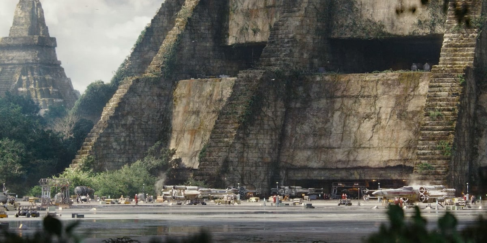
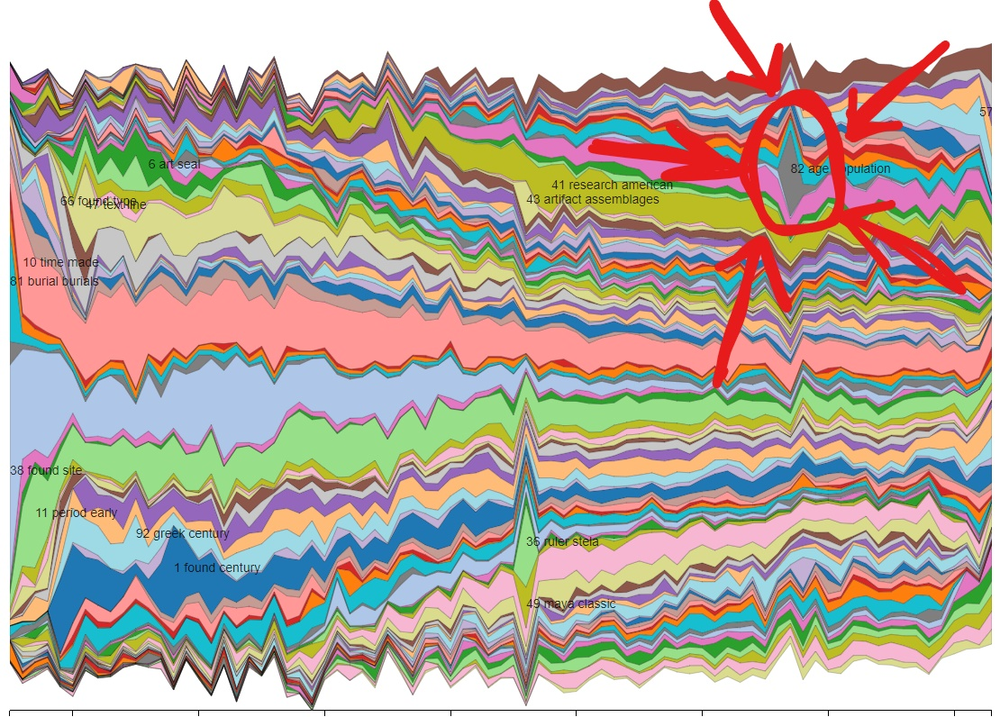

# Topic Model
  The first spike that caught my attention in the topic models was the one circled below:
   
  This topic had a surge in popularity in 1976 which is only 6 years after the end of a major archeological project done by the University of Pennsylvania. I also learned (through [wikipedia](https://en.wikipedia.org/wiki/Tikal) so we will take it with a grain of salt) that the site was used by George Lucas for Star Wars Episode IV, released in 1977, and by Eon Prouctions for Moonraker, released in 1979, which is roughly around the same time as the surge in its poplarity in archeaological writing as well. I don't know if the journals impacts the movies being filmed there or the films increased the number of articles being written, but either way I doubt that it's a coincidence that both the archaeological world and movie world shwo interest at the same time.  [Source](https://lumiere-a.akamaihd.net/v1/images/rebel-massassi-outpost-main_6f7094bd.jpeg?region=0%2C38%2C1200%2C600)

  The next spike I saw was this one here: 
  
  In this topic, the main words that were mentioned included population and age in the year 1997. This made me think of the Boomers right away, since this would have been close to the start of when the Bommer generation would start to have families. But as I read through the article titles that were assiciated with this spike I saw that it looked a lot at Ancient societies, and fertility rates, which I found interesting, so I went on digging to see what the reason was. The top 18 documents were all from *Current Anthropology* so I began by seeing what was happening in the 1990s to cause this sudden interest in population, age and fertility. After some digging I came a cross this [video](https://www.youtube.com/watch?v=DBTgEzhJNM0) and this [site](https://en.wikipedia.org/wiki/Paul_R._Ehrlich#The_Population_Explosion_(1990)) which discusses the fears of overpopulation and fertility from the 1960s all the way through to the 1990s, so I would assume that because of this there was a spike in dicussion on popluation in many fields, not only archaeology and anthropology. 

I think the second topic is definitly an important one for the work we are doing in this course, because of the connection to mortality. It makes me think about how large our population is and how we are running out of space for both the living and the dead, and what that will mean for all of these important monument that we are in the process of recording. Will we lose our traditions in favour for a new system that does not respect the dead the way many cutures have in the past? Will we need to increase the rate in which we are recording this data so that it is not lost forever? Or will there be a fight for the preservation of gravesites? These are all important questions to think about going forward, when considering the limits of our world and the ever changing morals that we possess. 
