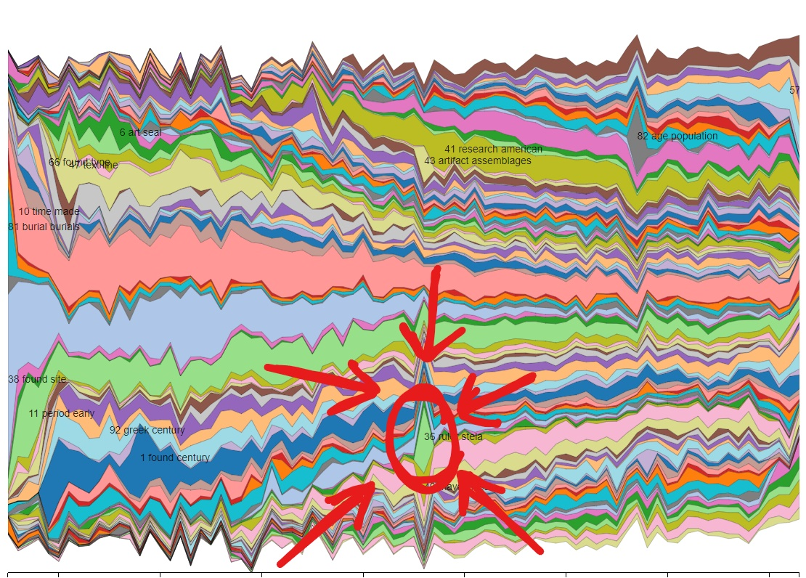

# Topic Model
  The first spike that caught my attention in the topic models was the one circled below:
  
   
  This topic had a surge in popularity in 1976 which is only 6 years after the end of a major archeological project done by the University of Pennsylvania. I also learned (through [wikipedia](https://en.wikipedia.org/wiki/Tikal) so we will take it with a grain of salt) that the site was used by George Lucas for Star Wars Episode IV, released in 1977, and by Eon Prouctions for Moonraker, released in 1979, which is roughly around the same time as the surge in its poplarity in archeaological writing as well. I don't know if the journals impacts the movies being filmed there or the films increased the number of articles being written, but either way I doubt that it's a coincidence that both the archaeological world and movie world shwo interest at the same time.  [Source](https://lumiere-a.akamaihd.net/v1/images/rebel-massassi-outpost-main_6f7094bd.jpeg?region=0%2C38%2C1200%2C600)

  The next spike I saw was this one here: 
  
  
